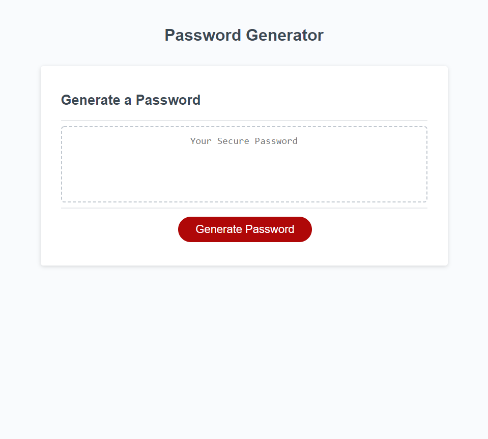

# Password-Generator

## Description

This project was created to randomly generate a password for an employee that provides greater security. This is done by fulfilling the following requirements:
* A generate password button is clicked and presents a series of prompts for password criteria.
* A prompt directs the user to select a password length that is at least 8 characters long and no more than 128 characters long.
* Each password criteria prompt allows the user to choose whether or not they want certain characters in their password.
* The user can confirm whether or not they want to include lowercase, uppercase, numeric, and/or special characters.
* Upon answering each prompt, the input is validated with a requirement of at least one type of character selected.
* Upon answering all prompts, the password matches the selected criteria.
* Upon generating the password, the password is displayed in a prompt or written to the page.

## Table of Contents (Optional)

If your README is long, add a table of contents to make it easy for users to find what they need.

- [Installation](#installation)
- [Links](#links)
- [Usage](#usage)
- [Creation](#creation)
- [Credits](#credits)
- [License](#license)

## Installation
The repository, Password-Generator, was created and cloned from GitHub. An index.html file was created and was coded to contain the site content. A folder, assets, was created to house two folders, css and js.  The css folder contains the style sheet, style.css, which was a default styling sheet and was not altered. The js folder contains the script sheet, script.js, which was coded to allow the user to interact with the site in order to generate a password.

## Links
- [GitHub Repository](https://github.com/amklenk/Password-Generator)
- [GitHub Pages Site](https://amklenk.github.io/Password-Generator/)

## Usage

Below is a screenshot of the live site.

The site should fulfill all of the requirements so that the user can interactively generate a secure password.

## Creation

Each of the requirements was fullfilled:
* When the generate password button is clicked, the site presents a series of prompts for password criteria.
* A prompt directs the user to select a password length that is at least 8 characters long and no more than 128 characters long.
* Each password criteria prompt allows the user to choose whether or not they want certain characters in their password.
* The user can confirm whether or not they want to include lowercase, uppercase, numeric, and/or special characters.
* Upon answering each prompt, the input is validated with a requirement of at least one type of character selected.
* Upon answering all prompts, the password matches the selected criteria.
* Upon generating the password, the password is displayed in a prompt or written to the page.

Once the respository was installed locally, since the html and css files were already created, the js file contains all of the coded changes.

The JavaScript code is organized by objects, functions, and event listeners. All of the code was first pseudocoded (as shown in the comments on the script.js file, which represent a pared-down version of the pseudocode). Each object is an array that holds one of four types of characters:
- lowercase letters
- uppercase letters
- numbers
- special characters (symbols)

The functions are as follows:
- The index generator randomly iterates over the array of all selected characters a number of times that matches the password length selected by the user. It joins the iterated strings into a password.
- The writePassword function allows the user to select a number of characters between 8 and 128 using prompts and returning a value passLength (the length of the password).
- The chooseCharacters function allows the user to select the characters they want to include (they must pick at least one type) and create an array of those characters. This array, charactersArray, is returned with passLength.
- The generatePassword function takes the joined string from the index generator and displays it to the page in the box above the generate button.

The only event listener is an onclick event for the generate button to start the prompts in the writePassword function by calling on the generatePassword function that then calls upon each preceeding function.

## Credits
The following MDN websites were used as referene pages:
- [MDN Array - JavaScript](https://developer.mozilla.org/en-US/docs/Web/JavaScript/Reference/Global_Objects/Array)
- [MDN Array.prototype.concat - JavaScript](https://developer.mozilla.org/en-US/docs/Web/JavaScript/Reference/Global_Objects/Array/concat)
- [MDN Array.prototype.join - JavaScript](https://developer.mozilla.org/en-US/docs/Web/JavaScript/Reference/Global_Objects/Array/join)

## License

MIT License

Copyright (c) [2022] [Amanda Klenk]

Permission is hereby granted, free of charge, to any person obtaining a copy
of this software and associated documentation files (the "Software"), to deal
in the Software without restriction, including without limitation the rights
to use, copy, modify, merge, publish, distribute, sublicense, and/or sell
copies of the Software, and to permit persons to whom the Software is
furnished to do so, subject to the following conditions:

The above copyright notice and this permission notice shall be included in all
copies or substantial portions of the Software.

THE SOFTWARE IS PROVIDED "AS IS", WITHOUT WARRANTY OF ANY KIND, EXPRESS OR
IMPLIED, INCLUDING BUT NOT LIMITED TO THE WARRANTIES OF MERCHANTABILITY,
FITNESS FOR A PARTICULAR PURPOSE AND NONINFRINGEMENT. IN NO EVENT SHALL THE
AUTHORS OR COPYRIGHT HOLDERS BE LIABLE FOR ANY CLAIM, DAMAGES OR OTHER
LIABILITY, WHETHER IN AN ACTION OF CONTRACT, TORT OR OTHERWISE, ARISING FROM,
OUT OF OR IN CONNECTION WITH THE SOFTWARE OR THE USE OR OTHER DEALINGS IN THE
SOFTWARE.

